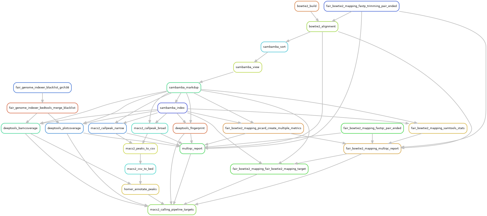

[](https://snakemake.github.io)
[](https://github.com/tdayris/fair_macs2_calling/actions?query=branch%3Amain+workflow%3ATests)

Do not use. Active dev.

Snakemake workflow used to call peaks with Macs2 and annotate them with Homer.

## Usage

The usage of this workflow is described in the [Snakemake workflow catalog](https://snakemake.github.io/snakemake-workflow-catalog?usage=tdayris/fair_macs2_calling) 
it is also available [locally](https://github.com/tdayris/fair_macs2_calling/blob/main/workflow/report/usage.rst) on a single page.
 
## Results

A complete description of the results can be found here in [workflow reports](https://github.com/tdayris/fair_macs2_calling/blob/main/workflow/report/results.rst).

## Material and Methods

The tools used in this pipeline are described [here](https://github.com/tdayris/fair_macs2_calling/blob/main/workflow/report/material_methods.rst) textually. Web-links are available below:



### Index and genome sequences with [`fair_genome_indexer`](https://github.com/tdayris/fair_genome_indexer/tree/main)

See pipeline content at [`fair_genome_indexer`](https://github.com/tdayris/fair_genome_indexer/tree/main)


### Raw-sequences QC with [`fair_fastqc_multiqc`](https://github.com/tdayris/fair_fastqc_multiqc/)

See pipeline content at [`fair_fastqc_multiqc`](https://github.com/tdayris/fair_fastqc_multiqc/)

### Bowtie2 Mapping with [`fair_bowtie2_mapping`](https://github.com/tdayris/fair_bowtie2_mapping/tree/main)

See pipeline content at [`fair_bowtie2_mapping`](https://github.com/tdayris/fair_bowtie2_mapping/tree/main)

### Peak Calling

| Step              | Wrapper                                                                                                          |
| ----------------- | ---------------------------------------------------------------------------------------------------------------- |
| Coverage analysis | [deeptools-bamcoverage](https://snakemake-wrappers.readthedocs.io/en/stable/wrappers/deeptools/bamcoverage.html) |
| Peak-Calling      | [macs2-callpeak](https://snakemake-wrappers.readthedocs.io/en/v5.5.0/wrappers/macs2/callpeak.html)               |
| Annotation        | [homer-annotatepeaks](https://snakemake-wrappers.readthedocs.io/en/v5.5.0/wrappers/homer/annotatePeaks.html)     |


```
┌─────────────────────────────────────────┐
│ Aligned reads (see fair_bowtie2_mapping)│
└───────────────┬─────────────────────────┘
                │                          
                │                          
┌───────────────▼──────────┐               
│ Bam coverage (deeptools) │               
└───────────────┬──────────┘               
                │                          
                │                          
┌───────────────▼──────┐                   
│ Peak-Calling (Macs2) │                   
└───────────────┬──────┘                   
                │                          
                │                          
┌───────────────▼─────────┐                
│ Peak-Annotaiton (homer) │                
└─────────────────────────┘                
```


### Quality Controls

| Step            | Wrapper/Official documentation                                                                                           |
| --------------- | ------------------------------------------------------------------------------------------------------------------------ |
| MultiQC         | [multiqc-wrapper](https://snakemake-wrappers.readthedocs.io/en/v5.5.0/wrappers/multiqc.html)                             |
| Finger prints   | [deeptools-plotfingerprint](https://snakemake-wrappers.readthedocs.io/en/v5.5.0/wrappers/deeptools/plotfingerprint.html) |
| Plot Coverage   | [deeptools-plotcoverage](https://snakemake-wrappers.readthedocs.io/en/v5.5.0/wrappers/deeptools/plotcoverage.html)       |
| Plot Enrichment | [deeptools-plotenrichment](https://deeptools.readthedocs.io/en/develop/content/tools/plotEnrichment.html)                |
| Plot PCA        | [deeptools-plotpca](https://deeptools.readthedocs.io/en/develop/content/tools/plotPCA.html)                              |


```
                 ┌────────────────────┐                          
                 │fair_bowtie2_mapping├─────────────────────────┐
                 └─┬─────────┬────────┘                         │
                   │         │                                  │
                   │         │                                  │
┌──────────────────▼─┐       │    ┌────────────────────────┐    │
│Peak-calling (macs2)├───────┼────┤Correlations (deeptools)◄────┤
└──────────────────┬─┘       │    └────────────────────────┘    │
                   │         │                                  │
                   │         │                                  │
┌──────────────────▼────┐    │    ┌──────────────────────┐      │
│Peak-annotaiton (homer)├────┼────┤Enrichment (deeptools)◄──────┤
└───────────────────────┘    │    └──────────────────────┘      │
                             │                                  │
                             │                                  │
┌────────────────────┐       │     ┌───────────────┐            │
│ fair_fastqc_multiqc├───────┼─────┤PCA (deeptools)◄────────────┘
└────────────────────┘       │     └───────────────┘             
                             │                                   
                             │                                   
                             │                                   
                             │                                   
                         ┌───▼──────┐                            
                         │          │                            
                         │ MultiQC  │                            
                         │          │                            
                         └──────────┘                                                      
```
